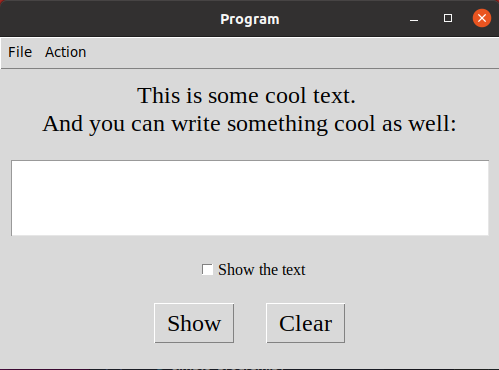

# tkinter simple program project

### 09.12.2023

My first try using tkinter. Tested tkinter out. I've built general window with Label, Textbox, Checkbox, Button, Menubar, MessageBox etc

## How it looks like:

## Functionalities:
- You can type text and if you have checked checkbox and press the button you will see a messagebox with this text
    - if field is empty you will see a corresponding message.
    - if checkbox isn't chosen you will see a corresponding message
- You have Clean button for deleting all filled field 
- If you want to quit and press (X) you will see messagebox with two options - Quit or Not Quit
    - If you want to quit without this message you can choose this option in Menubar Section File